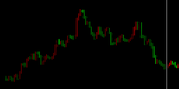
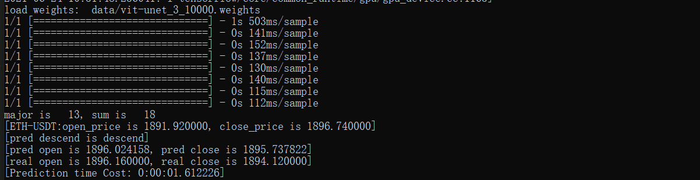

## 基于TransUnet模型实现的离线加密货币价格区间预测器

目前，对于BTC，ETH价格预测相关工具已经相对丰富，但多是需要用户通过访问api或web的形式进行获取，受限于网络时延，该套方案的应用参考价值相对有限。基于此，我们试图构建一个离线的价格区间预测器，为用户提供一个工具，通过分析数据，给出未来一段时期相对准确的价格区间的估计。为了满足一段时期的要求，本项目抛弃传统时序分析的方法，转为CV的视角对该问题进行建模求解。

## Preparation

```
pip install -r requirements.txt
```


网络使用了ViT-Unet模型，参考[https://arxiv.org/abs/2102.04306](https://arxiv.org/abs/2102.04306)，即在Unet底部增加一个Transformer的Encoder。


### 目前实现的：

1. 从okex获取ETH以太币的实时价格数据；（apikey-secret已预设一份，后续使用需要根据okex要求调整相应的参数）
2. 生成训练用的价格曲线图片，一个图片有100个数据（例如100个小时数据）。每个数据包括开盘价、收盘价、交易量，上涨用红色表示，下跌用绿色表示，交易量会换算成颜色深浅；
3. 模型可预测多个点，可以调整mask_num；
4. 预测结果由图像向数值量化（存在精度误差，需要后续改进）
5. 模型使用Keras构建，后端是tensorflow 1.15.4




## Prediction

```
python predict_vitunet.py --currency=xxx-USDT
```
使用该方法开始预测，currency可选择各类加密货币，展示为基于mask技术进行的对照测试结果，若需获得后续预测结果，可通过调节mask_num或predict_n实现。

## Results


